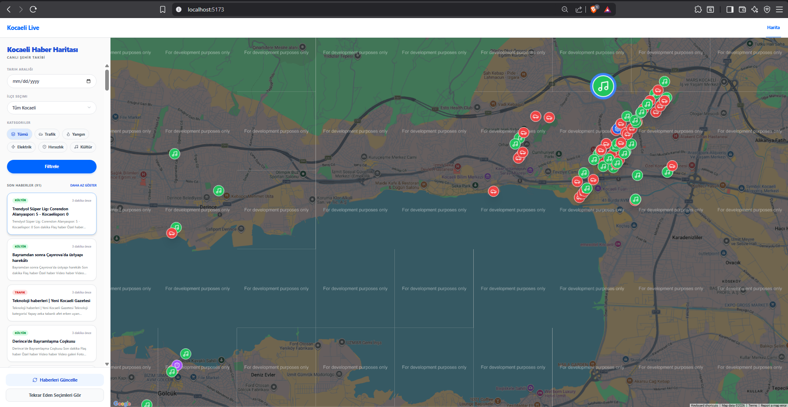

# Kocaeli Live — Intelligent Urban News Monitor

> A full-stack, AI-powered web platform that automatically scrapes, classifies, and maps local breaking news across the **Kocaeli** province in real-time.



---

## 📋 Table of Contents

- [About the Project](#-about-the-project)
- [Key Features](#-key-features)
- [Project Architecture](#%EF%B8%8F-project-architecture)
- [Tech Stack](#-tech-stack)
- [Installation & Setup](#%EF%B8%8F-installation--setup)
- [Environment Variables](#-environment-variables)
- [How It Works](#-how-it-works)
- [API Endpoints](#-api-endpoints)

---

## 🧠 About the Project

**Kocaeli Live** is a robust urban intelligence platform built for *Kocaeli University — Software Laboratory II*. It continuously monitors 5 major local Kocaeli news outlets, processes each article through a highly optimized GPU-accelerated NLP pipeline, and pins each event onto an interactive Google Map.

The system is designed around three core pillars:
1. **High-Speed Autonomous Scraping** — A decoupled architecture combining `cloudscraper` and `SeleniumBase (UC Mode)` to securely bypass aggressive Cloudflare Turnstile WAF blocks while harvesting articles asynchronously.
2. **AI-Powered Intelligence** — Utilitzes the zero-shot `mDeBERTa-v3-base-mnli-xnli` model (CUDA accelerated) to semantically classify raw Turkish texts into strict categories alongside an intelligent location extraction engine.
3. **Precision MongoDB Deduplication** — A TF-IDF cosine-similarity engine (`>= 90%` threshold) prevents map clutter. It merges identical stories reported across multiple agencies into a single canonical MongoDB document via `$addToSet` arrays.

---

## 🚀 Key Features

| Feature | Description |
|---|---|
| 🕷️ **WAF-Bypass Scraper** | Seamlessly scrapes 5 local news sites while defeating Cloudflare protections. Enforces a strict 3-day freshness window. |
| 🤖 **GPU-Accelerated NLP** | HuggingFace mDeBERTa pipeline categorizes Turkish text instantly. Discards irrelevant news and locations. |
| 🔁 **Array-Based Deduplication** | Detects semantic duplicates and dynamically updates the MongoDB document to list all reporting sources. |
| 📍 **Smart Geocoding** | OpenCage API converts extracted district names into GPS coordinates, aggressively cached within MongoDB. |
| 🗺️ **Interactive Live Map** | Smoothly renders custom SVG category-icon markers (🚗 Trafik, 🔥 Yangın, ⚡ Elektrik, 🛡️ Hırsızlık, 🎵 Kültür). |
| 🔍 **Dynamic Filtering** | Instantly filter map markers and the news feed by Category, District, or Date—without any page reloads. |
| 📰 **Hover-to-Pin Sync** | Hovering over a news card in the sidebar dynamically enlarges its physical pin on the map. |

---

## 🏗️ Project Architecture

```
yazlab_1/
│
├── README.md
└── Kocaeli_Live/
    │
    ├── backend/              # Python Quart Async API Server
    │   ├── app.py            # Routes: /api/news, /api/sync-news
    │   ├── requirements.txt
    │   └── modules/
    │       ├── scraper.py    # Cloudscraper + aiohttp parallel scraping
    │       ├── cloudflare_bypass.py # SeleniumBase UC Mode cookie harvester
    │       ├── nlp.py        # TF-IDF Cosine Similarity + mDeBERTa pipeline
    │       └── geocoding.py  # OpenCage REST API + MongoDB Caching
    │
    └── frontend/             # React 18 + Vite SPA
        ├── src/
        │   ├── App.jsx       # Root layout, dynamic filtering states
        │   └── components/
        │       ├── Sidebar.jsx
        │       ├── MapView.jsx
        │       └── DuplicateReportModal.jsx
        └── .env              # VITE_GOOGLE_MAPS_API_KEY
```

---

## 🛠️ Tech Stack

**Backend**
- [Python Quart](https://quart.palletsprojects.com/) — Asynchronous web framework
- [Motor](https://motor.readthedocs.io/) — Async Python driver for MongoDB
- [HuggingFace Transformers](https://huggingface.co/) — `mDeBERTa` zero-shot NLP model
- [SeleniumBase](https://seleniumbase.io/) — Undetected ChromeDriver (UC Mode) for WAF bypass
- [scikit-learn](https://scikit-learn.org/) — TF-IDF Vectorizer & Cosine Similarity

**Frontend**
- [React 18](https://react.dev/) + [Vite](https://vitejs.dev/)
- [Tailwind CSS](https://tailwindcss.com/) — Rapid UI styling
- [@vis.gl/react-google-maps](https://visgl.github.io/react-google-maps/) — Advanced map components
- [Lucide React](https://lucide.dev/) — Crisp SVG icons

**Database & APIs**
- [MongoDB](https://www.mongodb.com/) — Primary NoSQL document store
- [OpenCage Geocoding API](https://opencagedata.com/) — District string to Latitude/Longitude conversion
- [Google Maps API](https://developers.google.com/maps) — Dynamic geospatial rendering

---

## ⚙️ Installation & Setup

> **Prerequisites:** Python 3.10+, Node.js 18+, MongoDB running locally (default 27017) or via Atlas, API keys for OpenCage and Google Maps.

### 1. Clone the Repository
```bash
git clone https://github.com/Abd2023/Kocaeli_Live.git
cd Kocaeli_Live
```

### 2. Backend Setup
```bash
cd backend

# Create and activate virtual environment
python -m venv venv
venv\Scripts\activate        # Windows
# source venv/bin/activate   # macOS/Linux

# Install required Python dependencies
pip install -r requirements.txt

# Configure Environment Variables
# Create a `.env` file referencing the example section below.

# Start the asynchronous backend server
python app.py
```
*The API runs at **http://localhost:5000**. Note: On the first ever run, the `mDeBERTa` HuggingFace pipeline will automatically download the required model weights.* 

### 3. Frontend Setup
```bash
cd ../frontend

# Install Node dependencies
npm install

# Create frontend .env file
echo "VITE_GOOGLE_MAPS_API_KEY=your_google_maps_api_key" > .env

# Start the Vite development server
npm run dev
```
*The UI opens interactively at **http://localhost:5173**.*

---

## 🔐 Environment Variables

Create a `.env` file in the `backend/` directory:
```env
MONGO_URI=mongodb://localhost:27017
DATABASE_NAME=kocaeli_live
OPENCAGE_API_KEY=your_opencage_api_key_here
```
Create a `.env` file in the `frontend/` directory:
```env
VITE_GOOGLE_MAPS_API_KEY=your_google_maps_api_key_here
```

---

## 👨‍💻 Developed By

**Software Laboratory II — Spring 2026**
*Kocaeli University Computer Engineering Department*
