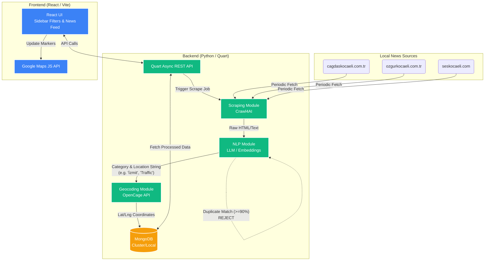

# Kocaeli Live - Architecture & Folder Structure

Here is the exact folder structure we will build and a Mermaid diagram illustrating how data flows from the news websites all the way to the Google Maps UI.

## Project Folder Structure

This structure strictly separates the backend (API & Scraping) from the frontend (UI), keeping the codebase clean and maintainable.

```text
c:\fun_project\yazlab_1\Kocaeli_Live\
├── backend/                           # Python Quart Application
│   ├── .env                           # API Keys (Google Maps, OpenCage, MongoDB URI)
│   ├── requirements.txt               # Python Dependencies
│   ├── app.py                         # Main Quart application & API endpoints
│   ├── core/
│   │   ├── config.py                  # Environment variable loader
│   │   └── database.py                # MongoDB connection (Motor)
│   └── modules/
│       ├── scraper.py                 # Scrapes sites via Crawl4AI
│       ├── nlp.py                     # Extracts JSON metrics (Category/Location) via LLM
│       └── geocoding.py               # Calls OpenCage API to map location => Coordinates
│
└── frontend/                          # React + Vite Application
    ├── package.json                   # React Dependencies
    ├── vite.config.js                 # Dev server config
    ├── tailwind.config.js             # Styling tokens (matching Figma design)
    ├── index.html                     # Entry HTML point
    └── src/
        ├── main.jsx                   # React DOM root
        ├── App.jsx                    # Application Layout Wrapper
        ├── api/
        │   └── client.js              # Fetch requests to Quart backend
        ├── components/
        │   ├── Sidebar.jsx            # The left panel with Filters
        │   ├── FilterGroup.jsx        # District dropdown, Category Pills, Date Picekr
        │   ├── NewsList.jsx           # The feed of recent news cards
        │   ├── MarkerInfo.jsx         # Custom React component for Google Maps popup
        │   └── MapView.jsx            # The Google Maps container element
        └── styles/
            └── index.css              # Custom CSS and Tailwind imports
```

---

## Architecture Diagram (Data Flow)

This diagram shows how data flows through the system. 
1. The **Scraper** fetches raw HTML/text.
2. The **NLP Engine** cleans and extracts the essential parameters.
3. The **Geocoding Engine** grabs the Lat/Lng.
4. The **Database** saves the full, de-duplicated JSON object.
5. The **Frontend** queries the database and commands the **Google Map** to place the markers perfectly.


